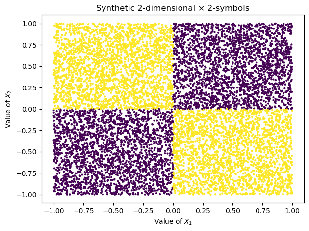
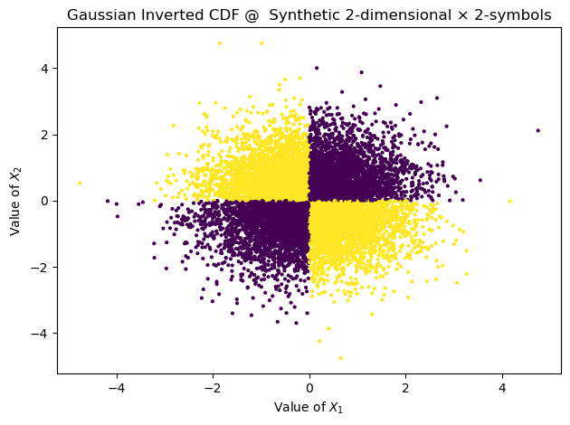
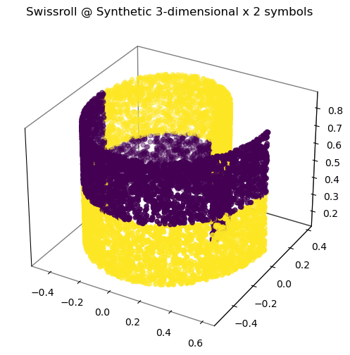
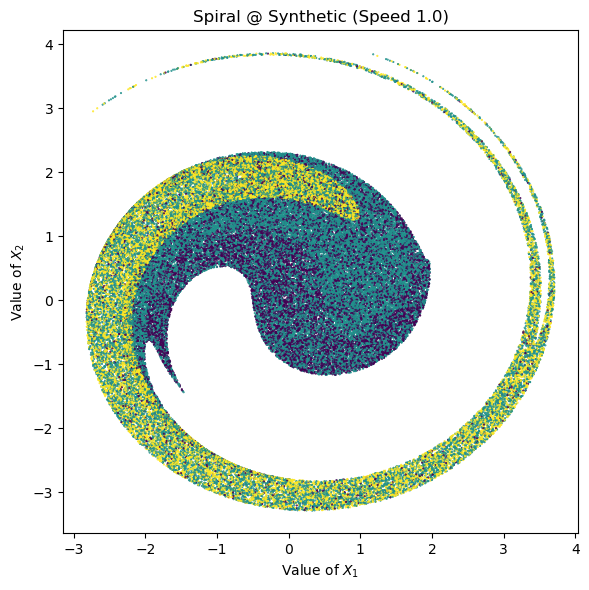

[](https://arxiv.org/abs/2306.11078)
[](https://neurips.cc/virtual/2023/poster/72978)
[](https://www.repostatus.org/#active)
[](https://pypi.org/project/benchmark-mi/)
[](https://github.com/cbg-ethz/bmi/actions/workflows/build.yml)
[](https://github.com/psf/black)

# Benchmarking Mutual Information

BMI is the package for estimation of mutual information between continuous random variables and testing new estimators.

- **Documentation**: [https://cbg-ethz.github.io/bmi/](https://cbg-ethz.github.io/bmi/)
- **Source code**: [https://github.com/cbg-ethz/bmi](https://github.com/cbg-ethz/bmi)
- **Bug reports**: [https://github.com/cbg-ethz/bmi/issues](https://github.com/cbg-ethz/bmi/issues)
- **PyPI package**: [https://pypi.org/project/benchmark-mi](https://pypi.org/project/benchmark-mi)

## Getting started
While we recommend taking a look at the [documentation](https://cbg-ethz.github.io/bmi/) to learn about full package capabilities, below we present the main capabilities of the Python package.
(Note that BMI can also be used to test non-Python mutual information estimators.)

You can install the package using:

```bash
$ pip install benchmark-mi
```

Alternatively, you can use the development version from source using:

```bash
$ pip install "bmi @ https://github.com/cbg-ethz/bmi"
```

Note: BMI uses [JAX](https://github.com/google/jax) and by default installs the CPU version of it.
If you have a device supporting CUDA, you can [install the CUDA version of JAX](https://github.com/google/jax#pip-installation-gpu-cuda-installed-via-pip-easier).

Now let's take one of the predefined distributions included in the benchmark (named "tasks") and sample 1,000 data points.
Then, we will run two estimators on this task.

```python
import bmi

task = bmi.benchmark.BENCHMARK_TASKS['1v1-normal-0.75']
print(f"Task {task.name} with dimensions {task.dim_x} and {task.dim_y}")
print(f"Ground truth mutual information: {task.mutual_information:.2f}")

X, Y = task.sample(1000, seed=42)

cca = bmi.estimators.CCAMutualInformationEstimator()
print(f"Estimate by CCA: {cca.estimate(X, Y):.2f}")

ksg = bmi.estimators.KSGEnsembleFirstEstimator(neighborhoods=(5,))
print(f"Estimate by KSG: {ksg.estimate(X, Y):.2f}")
```

## Evaluating a new estimator

The above code snippet may be convenient for estimating mutual information on a given data set or for the development of a new mutual information estimator.
However, for extensive benchmarking it may be more convenient to use one of the benchmark suites available in the `workflows/benchmark/` subdirectory.

For example, you can install [Snakemake](https://snakemake.readthedocs.io/en/stable/) and run a small benchmark suite on several estimators using:

```bash
$ snakemake -c4 -s workflows/benchmark/demo/run.smk
```

In about a minute it should generate minibenchmark results in the `generated/benchmark/demo` directory. Note that the configuration file, `workflows/benchmark/demo/config.py`, explicitly defines the estimators and tasks used, as well as the number of samples.

Hence, it is easy to benchmark a custom estimator by importing it and including it in the configuration dictionary.
More information is available [here](https://cbg-ethz.github.io/bmi/benchmarking-new-estimator/), where we cover evaluating new Python as well as non-Python estimators.

Similarly, it is easy to change the number of samples or adjust the tasks included in the benchmark.
We defined several benchmark suites with shared structure.

## List of implemented estimators

(Your estimator can be here too! Please, reach out to us if you would like to contribute.)

- The neighborhood-based KSG estimator proposed in [Estimating Mutual Information](https://arxiv.org/abs/cond-mat/0305641) by Kraskov et al. (2003).
- Donsker-Varadhan and MINE estimators proposed in [MINE: Mutual Information Neural Estimation](https://arxiv.org/abs/1801.04062) by Belghazi et al. (2018).
- InfoNCE estimator proposed in [Representation Learning with Contrastive Predictive Coding](https://arxiv.org/abs/1807.03748) by Oord et al. (2018).
- NWJ estimator proposed in [Estimating divergence functionals and the likelihood ratio by convex risk minimization](https://arxiv.org/abs/0809.0853) by Nguyen et al. (2008).
- Estimator based on canonical correlation analysis described in [Feature discovery under contextual supervision using mutual information](https://ieeexplore.ieee.org/document/227286) by Kay (1992) and in [Some data analyses using mutual information](https://www.jstor.org/stable/43601047) by Brillinger (2004).


## Synthetic dataset

The design of the `Synthetic` class from the IS Learning repository was leveraged to implement the `SyntheticSampler` class in the `_synthetic_sampler` script located in `src/bmi/samplers`. This new class keeps most of the attributes of the original class, but integrates specific functionalities from the BMI library, such as `sample` and `mutual_information`. SyntheticSampler is responsible for generating original data, calculating joint mutual information and generating metadata, among other tasks.

Following the structure of the BMI library, the `task_synthetic` function was designed in the `synthetic` script located in `src/bmi/benchmark/synthetic_tasks`. This function is a `Task` type element that facilitates sampling and computing mutual information using the aforementioned `SyntheticSampler`.

Within the `samplers` folder, the `_synthetic_transformed` script contains the `TransformedSampler` class. This sampler, designed for BMI transformations, has been extended with a new attribute `sample_split`. This attribute is specifically used to apply transformations such as `Wiggly mapping` and `Spiral diffeomorphism`, which require continuous dimensions in both X and Y. Hence, data is split to accommodate replacement of both variables.

Additionally, scripts for all transformations can be found in the `synthetic_tasks` folder. In these implementations, the transformation of the Y variable was adjusted to `None`, as our data does not feature a continuous Y variable to transform.

Finally, there are two files: a script named `bmi_synthetic_script` located in `scripts/Beyond_Normal/figures`and a Jupyter notebook named `task_synthetic_transformation_test` located in `notebooks` folder. These files facilitate testing of data generation and implementation of the mentioned transformations. 

### Synthetic data sampling

The following is an example of how to extract Synthetic data samples and visualize them in 2 or 3 dimensions. For this purpose, the simplest 2-dimensional x 2-symbol dataset will be used.

```python
import numpy as np

singular_2d_bounds: np.ndarray = np.empty(shape=2, dtype="object")

singular_2d_bounds[:] = [np.array([-1.0, 0.0, 1.0]), np.array([-1.0, 0.0, 1.0])]

singular_2d_scenario: Dict[str, np.ndarray] = {
    "sym_prob": np.array([0.5, 0.5]),
    "cell_bound": singular_2d_bounds,
    "cell_prob": np.array([[[0.5, 0.0], [0.0, 0.5]], [[0.0, 0.5], [0.5, 0.0]]])
    }
```
To sample from this scenario, you must first import the `synthetic_task` function and instantiate it with the scenario elements. Then, to extract the samples, you must call the `sample` attribute, which will return the X and Y samples.

```python
# Create a synthetic distribution object
synthetic_dist_singular_2d = task_synthetic(
   cell_boundaries=singular_2d_scenario['cell_bound'],
   symbol_probabilities=singular_2d_scenario['sym_prob'],
   cell_probabilities=singular_2d_scenario['cell_prob']
   )

# Number of samples
n_samples = 10_000
# Seed for random number generator 
SEED = 1234
# Sample 'n_samples' data points from the synthetic distribution 
x_sample, y_sample = synthetic_dist_singular_2d.sample(n_samples=n_samples, seed=SEED)
```
It's important to note that only the attributes `sample` and `mutual_information` can be used in this way. To use other attributes of `SyntheticSampler`, you must first call the `sampler` element of the `synthetic_task` function and then access the desired attribute. For example, in the following code, the `get_metadata` attribute of the sampler is used:

```python
# Print elements of the metadata
for element in synthetic_dist_singular_2d.sampler.get_metadata().items():
   print(f"{element[0]} : {element[1]}")

```
```bash
entropy_y : 1.0
in_shape : [2]
num_classes : 2
max_acc1 : 1.0
total_params : 16
mi_1 : 0.0
mi_2 : 0.0
mi_1-2 : 1.0
joint_mi : 1.0
```


To plot the data, the functions `plot_2d_figure` and `plot_3d_figure` must be used, depending on whether the data has 2 dimensions or more, respectively. These functions receive the following parameters:

- `X` and `y`: Dimensions of the Synthetic data.
- `cell_boundaries`: Boundaries of the scenario cells.
- `title`: Attribute `name` of the `task_synthetic` function instance.
- `savefig`: If you want to save the graphic.
- `savedata`: If you want to save the X and Y data.
- `plot_cells`: If you want to visualize the cells lines (only for 2-dimensional plots).


```python
  plot_2d_figure(
    X=x_sample,
    y=y_sample, 
    cell_boundaries=singular_2d_scenario['cell_bound'], 
    title=synthetic_dist_singular_2d.name,
    savefig=False,
    savedata=False
    )
```



### Apply a transformation

To implement a transformation on the synthetic data, it must be imported from the `synthetic_tasks` folder.

Next, you need to instantiate the function with the `task_synthetic` variable. To generate samples, call the `sample` attribute. For example, the following applies the Gaussian distribution transformation `gaussian_cdf` and plots it using either the `plot_2d_figure` or `plot_3d_figure` function, depending on whether the data has 2 dimensions or more.

```python
# Apply gaussian transformation
gaussian_cdf_transf = gaussian_cdf(base_task=synthetic_dist_singular_2d)
gaussian_x_sample, gaussian_y_sample = gaussian_cdf_transf.sample(n_samples=n_samples, seed=SEED)

# Obtain new cell bounds
new_cell_bound = update_cell_bounds(samples=gaussian_x_sample, scenario=singular_2d_scenario)

# Plot gaussian transformation
plot_2d_figure(
    X=gaussian_x_sample,                  
    y=gaussian_y_sample,                  
    cell_boundaries=new_cell_bound,       
    title=gaussian_cdf_transf.name,
    savefig=False,
    savedata=False,       
    plot_cells=False                     
    )
```


The `new_cell_bound` function is optional and is used to adjust the cells to the transformed data. However, its functionality is purely for visualization and can be disabled with the `plot_cells` variable.

The same method is used to apply the following transformations:
 - `student_cdf`
 - `half_cube`
 - `asinh`
 - `uniform_margins`

To apply the `swissroll` transformation, you must use the `uniform_margins` transformation variable, following the paper's implementation. If you want to visualize this transformation, you should use the `plot_swissroll` function, which handles the data dimensions for proper visualization. This function takes the following variables:

- `distribution`: Object of the `swissroll` function.
- `scenario`: Scenario of the Synthetic data.
- `x_swiss` and `y_swiss`: Transformed data.
- `x_sample`: Original Synthetic data.
- `dim`: Dimension of the transformed data to visualize.
- `savefig`: Whether to save the plot.
- `savedata`: Whether to save the X and Y data.


```python
# Apply uniform margins transformation
uniform_margins_map = uniform_margins(base_task=synthetic_dist_singular_2d)
uniform_x_sample, uniform_y_sample = uniform_margins_map.sample(n_samples=n_samples, seed=SEED)

# Generate data for a Swiss roll embedding task
swissroll_emb = swissroll(base_task=uniform_margins_map, task_name="Swissroll @ Synthetic")
X_swiss, Y_swiss = swissroll_emb.sample(n_samples=n_samples, seed=SEED)

# Plot swissroll transformation
plot_swissroll(
    distribution=swissroll_emb,
    scenario=singular_2d_scenario,
    x_swiss=X_swiss,  
    y_swiss=Y_swiss,
    x_sample=uniform_x_sample,
    dim=0,
    savefig=False,
    savedata=False
    )
```


To implement the `wiggly` and `spiral` transformations, you need to proceed differently. Unlike the previous transformations where the `sample` attribute is used to extract samples, for these two transformations you must use the `sample_split` attribute, which divides the dimensions of the synthetic data to use them as X and Y variables in the BMI code. To apply the corresponding divisions for each transformation, you need to input a `transformer` variable that takes the values "wiggly" and "spiral" as appropriate.

```python
# Apply wiggly transformation
wiggly_map = wiggly(base_task=synthetic_dist_singular_2d)
wiggly_x_sample, wiggly_y_sample = wiggly_map.sampler.sample_split(n_points=n_samples, rng=SEED, transformer="wiggly")

# Plot the 2D figure of the sampled data points
new_cell_bound = update_cell_bounds(samples=wiggly_x_sample, scenario=scenario)

# Plot wiggly transformation
plot_2d_figure(
  X=wiggly_x_sample,
  y=wiggly_y_sample, 
  cell_boundaries=new_cell_bound, 
  title=wiggly_map.name,
  plot_cells=False,
  savefig=False,
  savedata=False
  )
```
Unlike other transformations, the `spiral` function has certain additional variables. To apply this transformation, <u>`the data must have at least 5 dimensions`</u>, which are divided into `x_dim` and `y_dim`, representing the number of variables used for the X and Y variables in the transformation. Additionally, a `speed` variable is used, which is a magnitude that regulates the transformation. Moreover, this transformation has its own plotting function, `plot_spiral`, which is used to visualize the transformation as described in the paper.

```python
# Generate data for a Swiss roll embedding task
dims = [2, 3]
speed_list = [0.5, 1.0, 1.5]

# Generate spiral data for the given speed
spiral_diff = spiral(base_task=synthetic_dist_singular_2d, task_name="Spiral @ Synthetic", speed=speed_list[1], x_dim=dims[0], y_dim=dims[1])
x_spiral, y_spiral = spiral_diff.sampler.sample_split(n_points=n_samples, rng=SEED, transformer="spiral", spiral_dims=dims)

# Plot spiral diffeomorphism transformation
plot_spiral(
  X=x_spiral,
  y=y_spiral,
  speed=speed_list[1],
  title=spiral_diff.name,
  savefig=False, 
  savedata=False,
  )
```


### Indications

- BMI transformations can also be applied with Gaussian and t-student transformations, which can be visualized in the Jupyter notebook.

- The `wiggly` transformation is only applied to 2-dimensional data.

- The `spiral` transformation is only applied to data with more than 5 dimensions.

- Other transformations can be applied to data of any dimension.


## About the Transformations

The selection of transformations was based on maintaining the mutual information of the original data, which had normal and t-student distributions, both bivariate and multivariate. To achieve this, a theorem was demonstrated, which states:

>Let $X$, $X'$, $Y$, and $Y'$ be standard Borel spaces (e.g., smooth manifolds with their Borel σ-algebras) and $f : X → X'$ and $g: Y → Y'$ be continuous injective mappings. Then, for every $X$-valued r.v. $X$ and $Y$-valued r.v. $Y$ it holds that $I(X;Y) = I(f(X);g(Y))$. 

La lista de transformaciones implementadas del paper son las siguientes:

- **Half-cube map:** The transformation is used to lengthen the tails of distributions $X$ and $Y$. It applies the homeomorphism $h(x) = |x|^{3/2} \cdot \text{sign}(x)$, where \|x| is the absolute value of x and $\text{sign}(x)$ is the sign function that preserves the original sign of x. This transformation modifies the extreme values of the distribution, making the tails longer and more pronounced while maintaining symmetry around zero.

- **Asinh mapping:** The transformation is used to shorten the tails of distributions. It applies the inverse hyperbolic sine function $\text{asinh}(x) = \log(x + \sqrt{1 + x^2})$. This function reduces the extreme values of the distribution, making the tails shorter and less pronounced. At the same time, it maintains the central structure of the distribution but significantly decreases the influence of extreme values.

- **Uniform margins:** The transformation involves applying the Gaussian CDF $F$ to Gaussian random variables $X$ and $Y$ to obtain new random variables $(X' = F(X))$ and $(Y' = F(Y))$. $F(X)$ follows a uniform distribution $U(0,1)$, and $F(Y)$ also follows a uniform distribution $U(0,1)$. However, the joint distribution $P_{X'Y'}$ is not uniform. Despite this, mutual information is preserved.

- **Wiggly mapping:** The transformation is used to model non-uniform length scales by applying a function of the form $w(x) = x + \sum_{i} a_i \sin(\omega_i x + \phi_i)$, where $|a_i \omega_i| < 1$. This function adds a series of sinusoidal terms to x, each with its own amplitude $a_i$, frequency $\omega_i$, and phase $\phi_i$. The constraint $|a_i \omega_i| < 1$ ensures that the transformation is injective, meaning each input value corresponds to a unique output value, and it also preserves the mutual information between the transformed variables and the original ones.

- **Swiss Roll Embedding:** The transformation considers a mixed case where a one-dimensional random variable $X \sim \text{Uniform}(0,1)$ is smoothly embedded into two dimensions using the Swiss roll mapping, a popular technique in testing dimensionality reduction algorithms. In this implementation, the `swissroll2d` function takes an array of shape `(1,)` and uses the value `x[0]` to calculate the variable `t` using the formula $t = 1.5 \pi (1 + 2 x[0])$. It then computes the coordinates in 2D space with the formulas $x = \frac{t \cdot \cos(t)}{21.0}$ and $y = \frac{t \cdot \sin(t)}{21.0}$, generating a "swiss roll" shape. The result is returned as an array with coordinates scaled by a factor of 21 to adjust the scale appropriately.

- **Spiral Diffeomorphism:** The transformation defines a specific type of mapping in $\mathbb{R}^n$, where each point x is transformed by $f(x) = \gamma(||x||^2)x$. Here, $\gamma$ is a smooth function that uses orthogonal and skew-symmetric matrices to mix dimensions in a controlled manner. This approach is designed to preserve centered Gaussian distributions, ensuring that if a random variable $X$ follows $N(0, \sigma^2 I_n)$, then $f(X)$ also follows a similarly centered distribution.
  
  In the paper applies a spiral $x \rightarrow \exp(v_A ||x||^2)x$ to both variables $X$ and $Y$. This spiral uses skew-symmetric matrices $A_X$ and $A_Y$ to mix two dimensions effectively. Speed parameters $v_X$ and $v_Y$ compensate for the statistical properties of $X$, ensuring the transformation preserves the characteristics of a centered Gaussian distribution $N(0, I_m)$.

Additionally, two transformations were implemented on the synthetic data to convert them into a **Normal Distribution** and a **t-Student Distribution** by applying the inverse CDF of the respective distribution. The goal of these implementations is to evaluate the estimation capability of mutual information estimators when dealing with Gaussian and heavy-tailed distributions. Furthermore, these distributions can also undergo the previously listed transformations, providing a wide range of modifications to the original synthetic data.